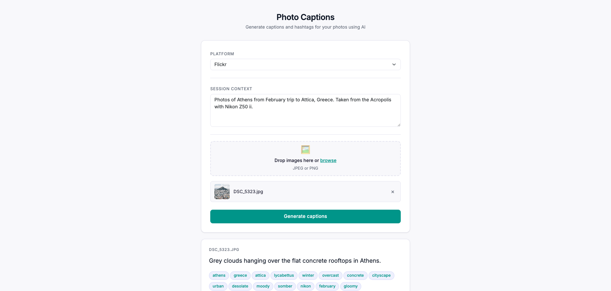

# photo-captions web

> **Personal project** — this is my own utility, built for my own use.

A zero-dependency vanilla JS web app that generates social-media captions and hashtags for batches of photos using Gemini 3 Flash via OpenRouter.



## Stack

- **Frontend:** Single-page app (`public/index.html` + `public/app.js`), Bootstrap 5 via CDN
- **Backend:** Single Vercel serverless function (`api/generate.js`), plain Node.js, no framework
- **Tests:** Node's built-in `node:test` module — zero test dependencies
- **Auth:** Password stored in `sessionStorage`, checked on every API call via `X-Auth-Token` header

## Local Development

### 1. Configure environment

Edit `.env.local`:

```
OPENROUTER_API_KEY=sk-or-...
MODEL=google/gemini-3-flash-preview
DEBUG=true
APP_PASSWORD=your-chosen-password
```

### 2. Start dev server

```bash
npm start
# → http://localhost:3000
```

## Tests

```bash
npm test
```

Runs all unit tests using Node's built-in `node:test`. No API key required — tests use mock data.

### Test coverage

- `test/processor.test.js` — `parseApiResponse` (all happy paths + all failure modes)
- `test/prompts.test.js` — `getPrompt` context substitution, unknown platform error

## Vercel Deployment

The app is automatically deployed on Vercel on every push to `main`.

To set it up from scratch:

1. Push the repo to GitHub
2. In the [Vercel dashboard](https://vercel.com/), click **Add New → Project**
3. Import the GitHub repo, leave the **Root Directory** as the repo root
4. Add these environment variables in Vercel:
   - `OPENROUTER_API_KEY`
   - `MODEL` (optional, defaults to `google/gemini-3-flash-preview`)
   - `APP_PASSWORD`
   - `DEBUG` (optional, set to `true` for verbose logging)
5. Click **Deploy** — Vercel will auto-deploy on every push to `main` from then on

## Philosophy

Keep it simple. This project aims to stay lean by avoiding unnecessary dependencies — no frameworks, no bundlers, no transpilers. Zero runtime dependencies.

- **Frontend:** plain HTML + vanilla JS + Bootstrap via CDN. No build step required.
- **Backend:** a single serverless function in plain Node.js. No framework overhead.
- **Tests:** Node's built-in `node:test`. No additional test framework to install or configure.

If a feature can be built without adding a dependency, it is.

## Architecture

```
Browser (vanilla JS)
  │  POST /api/generate  (JSON: platform, context, filename, imageBase64, mimeType)
  │  Header: X-Auth-Token: <APP_PASSWORD>
  ▼
api/generate.js (Vercel serverless function)
  │  Auth check → validate inputs → build prompt → call OpenRouter → parse+retry
  ▼
OpenRouter API (google/gemini-3-flash-preview)
```

## Project Structure

```
├── api/
│   └── generate.js         # Serverless function: auth, OpenRouter call, retry
├── lib/
│   ├── prompts.js           # Prompt templates + getPrompt()
│   └── processor.js         # parseApiResponse(), formatInstagramText()
├── public/
│   ├── index.html           # Single-page UI with Bootstrap 5 CDN
│   └── app.js               # Vanilla JS: drag & drop, fetch loop, results rendering
├── test/
│   ├── processor.test.js    # Unit tests for response parsing
│   └── prompts.test.js      # Unit tests for prompt generation
├── server.js                # Local dev server (zero-dependency, loads .env.local)
├── package.json
├── vercel.json
└── README.md
```

## Usage

1. Open the app in a browser
2. Enter the app password when prompted
3. Select a platform (Flickr, Instagram, or Reddit)
4. Describe the photo session in the context textarea
5. Drop or browse to select images
6. Click **Generate captions** — results appear progressively as each image is processed
7. Click individual hashtags to copy them, or use **Copy all** to copy caption + tags at once

